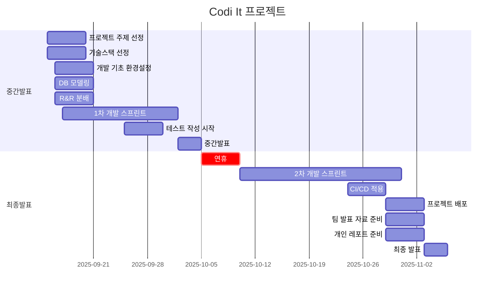

# 1팀 - CODI-IT 프로젝트

**CODI-IT**은 패션 이커머스 환경에서 판매자와 구매자를 연결하는 **고급 패션 커머스 플랫폼**입니다.

상품 등록부터 주문·결제·리뷰·알림·통계까지의 전 과정을 통합 관리할 수 있도록 설계되어,  
판매자에게는 효율적인 매출 관리 환경을, 구매자에게는 직관적이고 즐거운 쇼핑 경험을 제공합니다.

**진행 기간**: 2025.09.15 ~ 2025.11.03

<br>

## 구현 홈페이지

**백엔드**: [https://codi-it-backend.site](https://codi-it-backend.site/health)

**프론트엔드**: [https://codi-it-frontend.vercel.app](https://codi-it-frontend.vercel.app/products)

**Swagger**: [https://codi-it-backend.site/api-docs](https://codi-it-backend.site/api-docs/)

<br>

## 팀 구성 및 역할

### 팀 구성원

<table>
  <tr>
    <td align="center">
      <a href="https://github.com/hippo8427"><br /><sub><b>하상준</b></sub></a>
    </td>
    <td align="center">
      <a href="https://github.com/nbkominjae"><br /><sub><b>고민재</b></sub></a>
    </td>
    <td align="center">
      <a href="https://github.com/yun-heewon"><br /><sub><b>윤희원</b></sub></a>
    </td>
    <td align="center">
      <a href="https://github.com/stella62420"><br /><sub><b>김슬비</b></sub></a>
    </td>
    <td align="center">
      <a href="https://github.com/geonyoung28"><br /><sub><b>박건영</b></sub></a>
    </td>
  </tr>
</table>

<br>

### 팀원 별 담당 기능

| 이름   | 역할 | 담당 기능                                                                       |
| ------ | ---- | ------------------------------------------------------------------------------- |
| 하상준 | 팀장 | 인증, 유저, 등급, CI-CD, 배포, 이미지 업로드, 유닛 테스트, 통합 테스트, 팀 문서 |
| 고민재 | 팀원 | 상품, 문의, 답변, 사이즈, 카테고리, Swagger, 유닛 테스트                        |
| 윤희원 | 팀원 | 스토어, 관심스토어, 알림, 대시보드, 시연 영상 촬영, 유닛 테스트                 |
| 김슬비 | 팀원 | 장바구니, 주문, 구매, 유닛 테스트                                               |
| 박건영 | 팀원 | 리뷰, 별점 로직, 유닛 테스트                                                    |

<br>

## 프로젝트 상세 개요

### 전체 개발 일정



### ERD 구조

**ERD 구조**: [https://github.com/nb02-codi-it-team1/Codi-It-backend/wiki/ERD](https://github.com/nb02-codi-it-team1/Codi-It-backend/wiki/ERD-%EA%B5%AC%EC%A1%B0)

<br>

### 주요 기능

#### 인증

1. 이메일 및 비밀번호 기반 로그인/로그아웃

2. 판매자와 구매자에 따라 접근 가능한 기능 구분

3. JWT 토큰 재발급

#### 회원

1. 판매자/구매자 유형 선택 회원가입

2. 개인정보 수정, 조회, 탈퇴

3. 관심 스토어 조회

#### 스토어

1. 판매자 전용 기능: 스토어 등록, 수정, 조회

2. 관심 스토어 등록 및 해제 기능

3. 스토어별 상품, 판매량, 즐겨찾기 수 자동 연동

#### 상품

1. 상품 등록, 수정, 삭제, 조회

2. 카테고리·가격·사이즈·스토어·리뷰 기준 필터링 및 정렬

3. 할인율 및 기간 기반 프로모션 설정 가능

4. 상품별 사이즈 재고 및 판매량 자동 업데이트

#### 장바구니 / 결제

1. 구매자는 상품을 장바구니에 추가하고 로그인 유지 시에도 저장됨

2. 주문 시 포인트 사용 가능

3. 결제시 가상 결제 진행, 결제 완료 시 구매완료

4. 품절 상품 주문 시 예외 처리

#### 리뷰

1. 구매한 상품에 별점, 내용을 추가하여 리뷰 등록 가능

2. 리뷰 수정·삭제·조회 기능

#### 문의

1. 구매자 문의 등록 / 판매자 답변 기능

2. 비밀글 옵션, 답변 여부 상태 표시

#### 대시보드

1. 판매자 전용 분석 화면

2. 기간별 매출, 상품별 판매량, 가격대별 비중 등 데이터 시각화 제공

#### 알림

##### 실시간 이벤트 기반 알림

1. 구매자: 품절 알림, 문의 답변 알림, 재입고 알림

2. 판매자: 품절 상품 알림, 신규 문의 알림

<br>

## 기술 스택

|     분류     | 사용 도구                          |
| :----------: | ---------------------------------- |
|  프레임워크  | Node.js (Express)                  |
|     언어     | TypeScript                         |
|  스키마/ORM  | Prisma                             |
| 데이터베이스 | PostgreSQL                         |
|  API 문서화  | swagger                            |
| 실시간 알림  | SSE(Server-Sent Events)            |
|    테스트    | Jest + supertest                   |
|  코드 품질   | ESLint + Prettier, class-validator |
|    CI/CD     | Github Actions                     |
|     배포     | AWS EC2, S3, Nginx, PM2, RDS       |
|  협업 도구   | Discord, GitHub, Notion            |
|  일정 관리   | GitHub Issues + Notion             |

<br>

## 프로젝트 파일 구조

```
├─ prisma/
├─ node_modules/
│
├─ dist/
├─ src/
│   ├─ app.ts
│   ├─ server.ts
│   ├─ index.routes.ts
│   │
│   ├─ middleware/
│   │
│   ├─ common/
│   │   ├─ errors/
│   │   ├─ prisma/      (공용 DB 연결용)
│   │   ├─ utils/
│   │   └─ constants.ts
│   │
│   ├─ users/
│   │   ├─ user.routes.ts
│   │   ├─ user.controller.ts
│   │   ├─ user.service.ts
│   │   ├─ user.repository.ts
│   │    dtos/
│   │
│   ├─ auth/
│   ├─ product/
│   ├─ inquiry/
│   ├─ review/
│   ├─ stores/
│   ├─ cart/
│   ├─ dashboard/
│   └─ notification/
│
├─ tests/
├─ types/
│
├─ .env
├─ .env.example
├─ .gitignore
├─ eslint.config
├─ .prettier
├─ jest.config.js
├─ package.json
├─ package-lock.json
└─ tsconfig.json
```

## 협업 및 관리 문서

**팀 위키**: [https://github.com/nb02-codi-it-team1/Codi-It-backend/wiki](https://github.com/nb02-codi-it-team1/Codi-It-backend/wiki)

**팀 이슈**: [https://github.com/nb02-codi-it-team1/Codi-It-backend/issues](https://github.com/nb02-codi-it-team1/Codi-It-backend/issues?q=is%3Aissue%20state%3Aclosed)

**팀 PR**: [https://github.com/nb02-codi-it-team1/Codi-It-backend/pull-request](https://github.com/nb02-codi-it-team1/Codi-It-backend/pulls?q=is%3Apr+is%3Aclosed)

<br>
